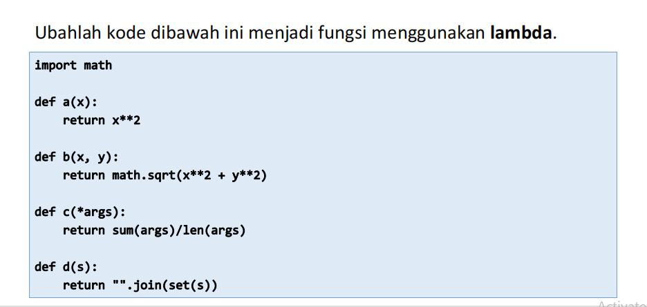
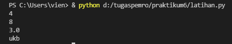

# praktikum6
<p> Nama    :   Viena Dwi Putri Maulina <p>
<p> NIM     :   312110469
<p> Kelas   :   TI.21.C1
<p> Tugas Bahasa Pemrograman <p>


```python
import math
def a(x):
  return x**2
a = lambda x : x**2
print(a(2))
def b(x, y):
  return math.sqrt(x**2 + y**2)
b = lambda x, y : x ** 2 + y ** 2
print(b(2, 2))
def c(*args):
  return sum(args)/len(args)
c = lambda *args : sum(args)/len(args)
print(c(1,2,3,4,5))
def d(s):
  return "".join(set(s))
d = lambda s: "".join(set(s))
print(d("buku"))

```
<p> Hasil run seperti berikut <p>

