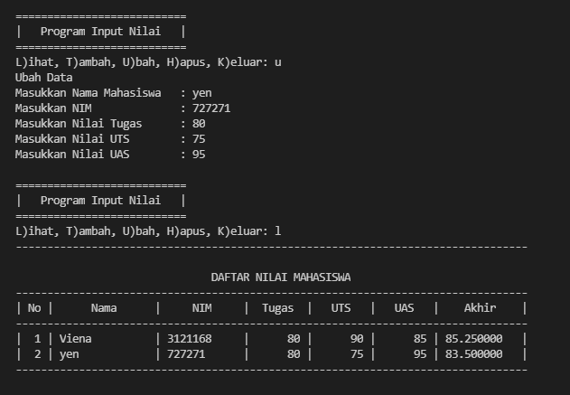

# praktikum6
<p> Nama    :   Viena Dwi Putri Maulina <p>
<p> NIM     :   312110469
<p> Kelas   :   TI.21.C1
<p> Tugas Bahasa Pemrograman <p>
<p> FUNGSI <p>

## Latihan 1

<p> berikut kode programnya <p>

```python
import math
def a(x):
  return x**2
a = lambda x : x**2
print(a(2))
def b(x, y):
  return math.sqrt(x**2 + y**2)
b = lambda x, y : x ** 2 + y ** 2
print(b(2, 2))
def c(*args):
  return sum(args)/len(args)
c = lambda *args : sum(args)/len(args)
print(c(1,2,3,4,5))
def d(s):
  return "".join(set(s))
d = lambda s: "".join(set(s))
print(d("buku"))

```
<p> Hasil run seperti berikut <p>


## Tugas Praktikum


<p> berikut kode programnya <p>

```python
x = {}

def tambah():
    print("Tambah Data")
    nama = input("Masukkan Nama Mahasiswa   : ")
    nim = input("Masukkan NIM              : ")
    tugas = int(input("Masukkan Nilai Tugas      : "))
    uts = int(input("Masukkan Nilai UTS        : "))
    uas = int(input("Masukkan Nilai UAS        : "))
    akhir = tugas * 30/100 + uts * 35/100 + uas * 35/100
    x[nama] = nim , tugas, uts , uas , akhir
def tampilkan():
    if x.items():
        print("---------------------------------------------------------------------------------")
        print("\n                               DAFTAR NILAI MAHASISWA                    ")
        print("---------------------------------------------------------------------------------")
        print("| No |      Nama      |     NIM     |  Tugas  |   UTS   |   UAS   |    Akhir    |")
        print("---------------------------------------------------------------------------------")
        i = 0                                                                         
        for b in x.items():                                                             
             i += 1
             print("| {no:2d} | {0:14s} | {1:11s} | {2:7d} | {3:7d} | {4:7d} | {5:7f}   |"
                . format ( b [ 0 ][: 14 ], b [ 1 ][ 0 ], b [ 1 ][ 1 ], b [ 1 ][ 2 ], b [ 1 ][ 3 ], b [ 1 ][ 4 ] , no = i ))
        print("---------------------------------------------------------------------------------")
    else :
        print("---------------------------------------------------------------------------------")
        print("\n                               DAFTAR NILAI MAHASISWA                    ")
        print("---------------------------------------------------------------------------------")
        print("| No |      Nama      |     NIM     |  Tugas  |   UTS   |   UAS   |    Akhir    |")
        print("---------------------------------------------------------------------------------")
        print("|                                TIDAK ADA DATA                                 |")
        print("---------------------------------------------------------------------------------")
def hapus():
    print ( "Hapus Data" )
    nama = input("Masukkan Nama Mahasiswa   : ")
    if  nama in  x . keys ():
        del  x [ nama ]
    else :
        print ( "Nama {0} Tidak Ditemukan" . format ( nama ))
def ubah():
    print ( "Ubah Data" )
    nama = input("Masukkan Nama Mahasiswa   : ")
    if nama in  x . keys ():
        nim = input("Masukkan NIM              : ")
        tugas = int(input("Masukkan Nilai Tugas      : "))
        uts = int(input("Masukkan Nilai UTS        : "))
        uas = int(input("Masukkan Nilai UAS        : "))
        akhir = tugas * 30/100 + uts * 35/100 + uas * 35/100
        x[nama] = nim , tugas, uts , uas , akhir
    else :
        print ( "Nama{0} Tidak Ditemukan" . format(nama ))

while True:
    print("")
    print("===========================")
    print("|   Program Input Nilai   |")
    print("===========================")
    c = input("L)ihat, T)ambah, U)bah, H)apus, K)eluar: ")
    if c.lower() == "l":
        tampilkan()
    elif c.lower() == "t":
        tambah()
    elif c.lower() == "u":
        ubah()
    elif c.lower() == "h":
        hapus()
    elif c.lower() == "k":
        print()
        print("---------------------------------------------------------------------------------")
        print("                                 PROGRAM TELAH SELESAI                    ")
        print("---------------------------------------------------------------------------------")
        break

    else:
        print()
        print("Kode yang anda masukkan salah!")
```

<p> kemudian run, dan akan muncul pilihan seperti berikut <p>


<p> kemudian ketik huruf sebagai pilihan yang diinginkan <p>
<p> L = untuk melihat/menampilkan data <p>
<p> T = untuk menambahkan data <p>
<p> U = untuk mengubah data <p>
<p> H = untuk menghapus data <p>
<p> K = untuk keluar dari program ini <p>

### T)ambah
<p> ketik t, kemudian isi data. misal mengisi 2 data<p>


### L)ihat
<p> ketik l, kemudian menampilkan data yang tadi ditambahkan <p>


### U)bah
<p> ketik u, kemudian ubah data yang diinginkan 



### H)apus
<p> ketik h, kemudian ketik nama data yang akan dihapus <p>


### K)eluar


<p> terimakasih <p>


